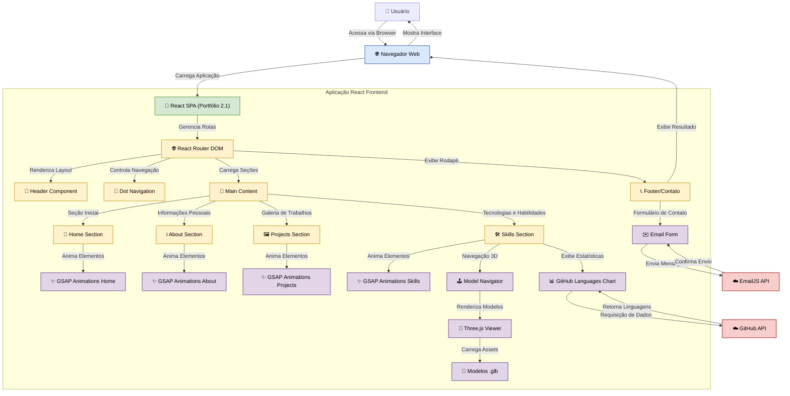

# Portfólio Interativo 2.1: Uma Jornada Visual pela Expertise de José Enoque

**Tecnologia, Resiliência e Inovação: Codificando o Futuro, Um Projeto de Cada Vez.**

## Abstract (Resumo Técnico)

Este projeto consiste em um portfólio web pessoal altamente interativo e visualmente dinâmico, desenvolvido para apresentar a trajetória, habilidades e projetos de José Enoque, um Desenvolvedor Full Stack com especialização em Automação de Processos, Infraestrutura e Soluções com Inteligência Artificial. A aplicação, concebida como uma Single Page Application (SPA) utilizando React, visa transcender os portfólios tradicionais ao oferecer uma experiência de usuário rica e engajadora. A solução emprega uma arquitetura baseada em componentes reutilizáveis, animações sofisticadas orquestradas com GSAP (GreenSock Animation Platform) e controladas por eventos de scroll, e a integração de modelos 3D interativos com Three.js para uma representação inovadora das competências técnicas.

A metodologia de desenvolvimento focou na modularidade, responsividade e na criação de uma narrativa visual coesa através das seções de Home, Sobre, Projetos e Habilidades. Destaca-se a integração com a API do GitHub para visualização dinâmica de proficiência em linguagens de programação e o uso de EmailJS para facilitar o contato direto. O resultado é uma plataforma digital que não apenas cataloga realizações, mas também demonstra proficiência nas tecnologias empregadas em sua construção, servindo como um testemunho prático das capacidades do desenvolvedor. Este portfólio representa uma abordagem contemporânea à autopromoção profissional, onde a forma e o conteúdo se unem para comunicar valor e expertise de maneira memorável.

## Badges Abrangentes

<p align="left">
  
  
  
  
  
</p>
<p align="left">
  
  
  
  
  
</p>
<p align="left">
  
  
  
  
</p>

## Sumário (Table of Contents)

1.  [Abstract (Resumo Técnico)](#abstract-resumo-técnico)
2.  [Badges Abrangentes](#badges-abrangentes)
3.  [Introdução e Motivação](#introdução-e-motivação)
4.  [Arquitetura do Sistema](#arquitetura-do-sistema)
5.  [Decisões de Design Chave](#decisões-de-design-chave)
6.  [✨ Funcionalidades Detalhadas (com Casos de Uso)](#-funcionalidades-detalhadas-com-casos-de-uso)
7.  [🛠️ Tech Stack Detalhado](#️-tech-stack-detalhado)
8.  [📂 Estrutura Detalhada do Código-Fonte](#-estrutura-detalhada-do-código-fonte)
9.  [📋 Pré-requisitos Avançados](#-pré-requisitos-avançados)
10. [🚀 Guia de Instalação e Configuração Avançada](#-guia-de-instalação-e-configuração-avançada)
11. [⚙️ Uso Avançado e Exemplos](#️-uso-avançado-e-exemplos)
12. [🔧 API Reference (se aplicável)](#-api-reference-se-aplicável)
13. [🧪 Estratégia de Testes e Qualidade de Código](#-estratégia-de-testes-e-qualidade-de-código)
14. [🚢 Deployment Detalhado e Escalabilidade](#-deployment-detalhado-e-escalabilidade)
15. [🤝 Contribuição (Nível Avançado)](#-contribuição-nível-avançado)
16. [📜 Licença e Aspectos Legais](#-licença-e-aspectos-legais)
17. [📚 Publicações, Artigos e Citações (se aplicável)](#-publicações-artigos-e-citações-se-aplicável)
18. [👥 Equipe Principal e Colaboradores Chave](#-equipe-principal-e-colaboradores-chave)
19. [🗺️ Roadmap Detalhado e Visão de Longo Prazo](#️-roadmap-detalhado-e-visão-de-longo-prazo)
20. [❓ FAQ (Perguntas Frequentes)](#-faq-perguntas-frequentes)
21. [📞 Contato e Suporte](#-contato-e-suporte)

## Introdução e Motivação

No cenário tecnológico atual, a capacidade de um desenvolvedor em comunicar eficazmente suas competências, experiências e projetos é tão crucial quanto sua proficiência técnica. Portfólios digitais emergiram como ferramentas indispensáveis nesse processo, contudo, muitos se limitam a apresentações estáticas ou genéricas que falham em capturar a essência da jornada e do potencial do profissional. Este projeto nasceu da necessidade de transcender essa limitação, criando um espaço digital que não apenas lista qualificações, mas que as demonstra ativamente através de uma experiência interativa e imersiva.

A motivação central para o desenvolvimento do "Portfólio Interativo 2.1" foi criar uma plataforma que refletisse a paixão de José Enoque pela tecnologia e sua jornada de resiliência e crescimento – desde suas experiências iniciais em trabalhos manuais até sua ascensão como especialista em desenvolvimento Full Stack, automação e IA. O objetivo é oferecer uma narrativa visual e interativa que engaje o visitante, permitindo-lhe explorar as habilidades e projetos de forma dinâmica. A proposta de valor reside na utilização de tecnologias de ponta como React, GSAP e Three.js para construir uma experiência memorável, que se destaca pela fluidez das animações, pela interatividade dos modelos 3D que representam competências técnicas, e por um design responsivo e elegante que se adapta a diversos dispositivos. Este portfólio visa ser mais do que uma vitrine; é uma declaração da dedicação à inovação e à excelência técnica.

## Arquitetura do Sistema

O "Portfólio Interativo 2.1" é uma Single Page Application (SPA) construída sobre a biblioteca React. Sua arquitetura é modular e orientada a componentes, visando a reutilização de código e a manutenibilidade.

**Componentes Principais:**

*   **Frontend (React SPA):** O núcleo da aplicação, responsável por renderizar a interface do usuário e gerenciar o estado da aplicação. É composto por várias seções (Home, Sobre, Projetos, Skills, Contato) que são carregadas dinamicamente.
*   **Módulos de Animação (GSAP):** Cada seção principal possui lógica de animação dedicada, utilizando a biblioteca GSAP e o plugin ScrollTrigger. Isso permite animações complexas e fluidas que respondem à interação do usuário e à rolagem da página. As animações são otimizadas para desempenho, com lógicas distintas para dispositivos desktop e mobile.
*   **Visualizador 3D (Three.js):** Integrado na seção "Skills", o `ModelNavigator` e o `ThreeDViewer` utilizam Three.js para carregar e exibir modelos 3D (no formato .glb) que representam diversas tecnologias e ferramentas. O usuário pode navegar e interagir com esses modelos.
*   **Lógica de UI (Componentes React):** Inclui componentes como `Header` (com alternância de tema e navegação principal que se oculta no scroll), `Footer` (com formulário de contato), `DotNavigation` (navegação lateral por pontos que aparece no scroll), e componentes específicos de cada seção.
*   **Integração com APIs Externas:**
    *   **GitHub API:** O componente `GithubLanguagesChart` busca dados dos repositórios do usuário no GitHub para exibir um gráfico das linguagens de programação mais utilizadas.
    *   **EmailJS API:** O formulário de contato no `Footer` utiliza EmailJS para enviar mensagens diretamente para o email do autor, sem a necessidade de um backend próprio para essa funcionalidade.

**Diagrama de Arquitetura:**



**Fluxo de Dados e Controle:**

*   O usuário interage com a SPA através do navegador.
*   O React Router DOM gerencia a navegação entre as diferentes seções (ancoradas por IDs).
*   Cada seção carrega seus respectivos componentes e conteúdo.
*   Os módulos de animação (GSAP) são ativados com base no scroll e na visibilidade dos elementos, modificando as propriedades CSS e atributos dos componentes para criar efeitos visuais.
*   Na seção "Skills", o `ModelNavigator` permite ao usuário selecionar diferentes modelos 3D, que são renderizados pelo `ThreeDViewer`. O `GithubLanguagesChart` faz uma requisição assíncrona à API do GitHub para buscar dados e renderizar o gráfico.
*   No `Footer`, o formulário de contato coleta os dados do usuário e, ao submeter, envia-os através da API do EmailJS.

**Decisões Arquiteturais Chave:**

*   **Single Page Application (SPA):** Escolhida para proporcionar uma experiência de usuário fluida e rápida, sem recarregamentos de página completos durante a navegação entre seções.
*   **Arquitetura Baseada em Componentes (React):** Facilita a modularidade, reutilização de código e manutenção. Cada parte da UI é encapsulada em seu próprio componente.
*   **Animações Declarativas e Imperativas (GSAP):** GSAP foi escolhido por sua performance, flexibilidade e controle granular sobre as animações, permitindo a criação de efeitos visuais sofisticados que enriquecem a experiência do usuário.
*   **Renderização 3D no Cliente (Three.js):** Para uma apresentação inovadora de habilidades, Three.js permite a incorporação de modelos 3D interativos diretamente no navegador, evitando a necessidade de plugins ou software externo.
*   **Estilização Híbrida (CSS Modules + TailwindCSS):** O projeto utiliza arquivos CSS dedicados por componente (semelhante a CSS Modules pela organização) para estilos complexos e específicos, e TailwindCSS (`tailwind.config.js` presente) para classes utilitárias, buscando um equilíbrio entre personalização e desenvolvimento ágil.
*   **Responsividade Adaptativa:** As animações e layouts são ajustados para diferentes tamanhos de tela, com animações mais complexas sendo, em alguns casos, desabilitadas em dispositivos móveis para garantir melhor performance e usabilidade.

## Decisões de Design Chave

Diversas decisões de design técnico foram tomadas para alcançar os objetivos de interatividade, performance e estética do portfólio:

1.  **Escolha do React como Biblioteca Principal:**
    *   **Justificativa:** React foi selecionado por seu paradigma de componentização, que permite a criação de uma UI modular, reutilizável e fácil de manter. Seu Virtual DOM contribui para atualizações eficientes da interface, crucial para uma SPA com muitas animações e interações dinâmicas. A vasta comunidade e ecossistema também foram fatores importantes.
    *   **Alternativas Consideradas:** Vue.js, Angular. Vue.js foi considerado por sua curva de aprendizado mais suave, mas React foi preferido pela familiaridade e pelo ecossistema robusto para animações e 3D. Angular foi considerado overkill para um projeto de portfólio.

2.  **Utilização do GSAP para Animações:**
    *   **Justificativa:** GSAP (GreenSock Animation Platform) foi escolhido por sua performance superior, API rica e flexível, e excelente compatibilidade entre navegadores. O plugin `ScrollTrigger` é particularmente poderoso para criar animações que respondem à rolagem da página, uma característica central da experiência do usuário neste portfólio.
    *   **Alternativas Consideradas:** Animações CSS puras, Framer Motion. Animações CSS são menos flexíveis para sequências complexas e controle fino. Framer Motion é uma excelente biblioteca para React, mas GSAP ofereceu um controle mais granular e uma API mais madura para os tipos de animações de timeline e scroll-based desejadas.

3.  **Integração de Three.js para Visualização 3D:**
    *   **Justificativa:** Para a seção "Skills", a ideia era apresentar as tecnologias de forma mais visual e interativa do que uma simples lista. Three.js permite a renderização de modelos 3D diretamente no navegador, oferecendo uma experiência única e memorável. A capacidade de carregar modelos `.glb` (formato eficiente para web) foi um plus.
    *   **Alternativas Consideradas:** Bibliotecas 3D de nível mais alto ou componentes React para 3D (como `react-three-fiber`). Three.js puro foi escolhido para maior controle sobre o pipeline de renderização e otimizações, embora `react-three-fiber` pudesse simplificar a integração com React.

4.  **Estrutura de Animação Modular e Condicional:**
    *   **Justificativa:** Cada seção principal (`Home`, `About`, `Projects`, `Skills`) possui seu próprio arquivo JavaScript dedicado à lógica de animação (ex: `src/Animation/Home/HomeAnimations.js`). Isso melhora a organização do código e facilita a manutenção. Além disso, muitas animações são condicionais, sendo aplicadas apenas em dispositivos desktop (verificando `window.innerWidth`) para otimizar a performance e a experiência em telas menores ou dispositivos móveis.
    *   **Trade-off:** A duplicação de lógica de verificação de `isDesktop` poderia ser centralizada, mas a abordagem atual mantém a lógica de animação autocontida por componente/seção.

5.  **Gerenciamento de Estado Local e Props:**
    *   **Justificativa:** Para um portfólio desta natureza, o gerenciamento de estado global complexo (como Redux ou Zustand) não foi considerado necessário. O estado é gerenciado localmente nos componentes ou passado via props, o que simplifica a arquitetura.
    *   **Consideração:** Para projetos maiores ou com interdependência de estado mais complexa, uma solução de gerenciamento de estado global seria mais apropriada.

6.  **Design Responsivo e Tematização (Claro/Escuro):**
    *   **Justificativa:** A responsividade é crucial para garantir uma boa experiência em todos os dispositivos. O projeto utiliza media queries em CSS e lógica JavaScript para adaptar layouts e funcionalidades. A tematização claro/escuro (`src/index.css`, `src/components/Header.js`) melhora a acessibilidade e a preferência do usuário.
    *   **Implementação:** Variáveis CSS são usadas para os temas, e o JavaScript alterna um atributo `data-theme` no elemento `html`, com estilos CSS correspondentes.

7.  **Uso de FontAwesome para Ícones:**
    *   **Justificativa:** FontAwesome oferece uma vasta biblioteca de ícones vetoriais, facilmente integráveis e customizáveis via CSS, agilizando o desenvolvimento da UI.
    *   **Alternativa:** Ícones SVG inline ou bibliotecas de ícones React (como `react-icons`, que também é utilizada). A combinação permite flexibilidade.

8.  **Integração com EmailJS para Formulário de Contato:**
    *   **Justificativa:** Para evitar a necessidade de um backend dedicado apenas para o envio de emails do formulário de contato, EmailJS oferece uma solução simples e eficaz do lado do cliente.
    *   **Trade-off:** Dependência de um serviço de terceiros e limites do plano gratuito/pago.

## ✨ Funcionalidades Detalhadas (com Casos de Uso)

O Portfólio Interativo 2.1 oferece uma gama de funcionalidades projetadas para proporcionar uma experiência de usuário rica e informativa:

1.  **Navegação Intuitiva e Fluida:**
    *   **Descrição:** O portfólio é uma Single Page Application (SPA) com navegação suave entre as seções. Possui um menu de cabeçalho fixo (que se oculta inteligentemente durante o scroll) e uma navegação lateral por pontos (`DotNavigation`) que também aparece contextualmente.
    *   **Caso de Uso:**
        *   Um recrutador acessa o portfólio e utiliza o menu no cabeçalho para pular diretamente para a seção "Projetos".
        *   Um visitante rola a página e a `DotNavigation` à direita indica a seção atual, permitindo cliques para navegação rápida.

2.  **Apresentação Pessoal Detalhada (Seção "Sobre Mim"):**
    *   **Descrição:** A seção "Sobre Mim" (`src/components/About.js`) apresenta a trajetória profissional e pessoal de José Enoque, destacando sua resiliência, formação em Engenharia da Computação, experiências em empresas como Tecnocomp e Positivo Tecnologia, e projetos chave como EsDataBase, Automation GUI e ExNeural. O texto é acompanhado por uma imagem e animações sutis.
    *   **Caso de Uso:**
        *   Um potencial colaborador lê a seção "Sobre Mim" para entender o background, as motivações e as áreas de expertise de José Enoque antes de propor uma colaboração.

3.  **Exibição Interativa de Projetos (Seção "Projetos"):**
    *   **Descrição:** A seção "Projetos" (`src/components/Projects.js`) lista os trabalhos desenvolvidos, atualmente destacando o "Projportfolio" (o próprio portfólio). Cada projeto é apresentado com uma imagem, título, descrição detalhada e um link para visualização ou acesso. Animações de entrada são aplicadas aos elementos do projeto.
    *   **Caso de Uso:**
        *   Um gerente de contratação explora a seção "Projetos", clica em "Ver Projeto" para analisar o "Projportfolio" e avalia a qualidade do código e do design.

4.  **Visualização Dinâmica de Habilidades (Seção "Skills"):**
    *   **Descrição:** Esta seção (`src/components/Skills.js`) combina duas formas inovadoras de apresentar competências:
        *   **ModelNavigator 3D:** Utiliza Three.js (`src/utils/ModelNavigator.js`, `src/utils/ThreeDViewer.js`) para exibir modelos 3D interativos de diversas tecnologias (ex: React, Node.js, Python). O usuário pode navegar entre os modelos usando setas do teclado ou pontos indicadores.
        *   **Gráfico de Linguagens do GitHub:** O componente `GithubLanguagesChart.js` busca dados da API do GitHub (requer token) e exibe um gráfico de barras com a porcentagem de uso das linguagens nos repositórios públicos do autor.
    *   **Caso de Uso:**
        *   Um líder técnico visita a seção "Skills", interage com os modelos 3D para visualizar as tecnologias dominadas e observa o gráfico de linguagens para ter uma ideia quantitativa da experiência de codificação.
        *   O usuário utiliza as setas do teclado para navegar entre os diferentes ícones de tecnologia em 3D.

5.  **Formulário de Contato Funcional (Seção "Contato" no Footer):**
    *   **Descrição:** O rodapé (`src/components/Footer.js`) contém um formulário de contato que permite aos visitantes enviar mensagens diretamente para José Enoque. A funcionalidade é implementada utilizando o serviço EmailJS. Informações de contato adicionais (email, WhatsApp) e links para perfis sociais (GitHub, LinkedIn) também estão presentes.
    *   **Caso de Uso:**
        *   Um cliente em potencial, impressionado com o portfólio, preenche o formulário de contato para iniciar uma conversa sobre um projeto freelancer.
        *   Um colega clica no ícone do LinkedIn para se conectar profissionalmente.

6.  **Animações Sofisticadas e Responsivas (GSAP):**
    *   **Descrição:** Praticamente todas as seções do portfólio são enriquecidas com animações sutis ou pronunciadas, controladas por GSAP e ScrollTrigger (`src/Animation/`). Elementos aparecem, deslizam, mudam de opacidade e escala conforme o usuário rola a página, criando uma experiência visualmente engajadora. As animações são otimizadas e, em alguns casos, simplificadas ou desabilitadas em dispositivos móveis para garantir performance.
    *   **Caso de Uso:**
        *   Ao rolar pela seção "Home", o texto de boas-vindas e os botões de CTA animam sua entrada, guiando o olhar do usuário.
        *   Na seção "Sobre", parágrafos e a imagem de perfil surgem gradualmente, tornando a leitura mais agradável.

7.  **Alternância de Tema (Claro/Escuro):**
    *   **Descrição:** O cabeçalho (`src/components/Header.js`) inclui um botão que permite ao usuário alternar entre um tema claro e um tema escuro. A preferência é salva no `localStorage` para persistir entre as visitas. As variáveis de cores são definidas em `src/index.css`.
    *   **Caso de Uso:**
        *   Um usuário que prefere interfaces escuras para leitura prolongada ativa o modo escuro para melhor conforto visual.

8.  **Dica de Navegação por Teclado:**
    *   **Descrição:** Ao interagir com o visualizador de modelos 3D na seção "Skills", um pop-up (`src/components/KeyboardHint.js`) informa ao usuário que ele pode usar as setas do teclado para navegar entre os modelos. Esta dica aparece apenas uma vez e sua visualização é controlada via `localStorage`.
    *   **Caso de Uso:**
        *   Um novo visitante, ao chegar na seção de Skills, é sutilmente informado sobre uma funcionalidade de navegação adicional, melhorando a descoberta de interações.

## 🛠️ Tech Stack Detalhado

O Portfólio Interativo 2.1 foi construído utilizando um conjunto moderno de tecnologias e ferramentas, escolhidas para otimizar a experiência do desenvolvedor, a performance da aplicação e a riqueza visual da interface.

| Categoria             | Tecnologia / Ferramenta          | Versão Específica (do `package.json`) | Propósito no Projeto                                                                                                | Justificativa da Escolha                                                                                                                                                             |
| --------------------- | -------------------------------- | ------------------------------------- | ------------------------------------------------------------------------------------------------------------------- | ------------------------------------------------------------------------------------------------------------------------------------------------------------------------------------ |
| **Frontend (Core)**   | React                            | `^18.2.0`                             | Biblioteca principal para construção da interface do usuário (UI) baseada em componentes.                             | Ecossistema robusto, componentização, Virtual DOM para performance, ampla adoção na indústria.                                                                                       |
|                       | React DOM                        | `^18.2.0`                             | Pacote específico do React para interação com o DOM do navegador.                                                     | Essencial para renderizar componentes React no browser.                                                                                                                              |
|                       | React Router DOM                 | `^6.26.2`                             | Gerenciamento de rotas e navegação para a Single Page Application (SPA).                                              | API moderna e flexível para roteamento em SPAs React, permitindo navegação por âncoras nas seções.                                                                                  |
| **Estilização**       | Tailwind CSS                     | `^3.4.14`                             | Framework CSS utilitário para estilização rápida e consistente.                                                     | Agilidade no desenvolvimento de UI, design responsivo facilitado, customizável. Usado em conjunto com CSS customizado.                                                               |
|                       | CSS Customizado                  | N/A                                   | Estilos específicos para componentes, animações complexas e tematização (arquivos em `src/styles/`).              | Necessário para estilos mais elaborados e específicos que vão além das classes utilitárias do Tailwind, e para a implementação dos temas claro/escuro.                               |
| **Animação**          | GSAP (GreenSock Animation Platform) | `^3.12.5`                             | Biblioteca de animação JavaScript de alta performance para criar animações complexas e interativas.                 | Performance superior, API poderosa e flexível, excelente para animações baseadas em scroll (`ScrollTrigger`) e timelines.                                                            |
| **Visualização 3D**   | Three.js                         | `^0.168.0`                            | Biblioteca JavaScript para criar e exibir gráficos 3D animados no navegador web.                                    | Vasta gama de funcionalidades, performance, flexibilidade para renderizar modelos `.glb` e criar cenas 3D interativas para a seção de Skills.                                          |
| **Gráficos**          | Chart.js                         | `^4.4.5`                              | Biblioteca para criação de gráficos e visualizações de dados.                                                       | Simples de usar, diversos tipos de gráficos, boa integração para exibir o `GithubLanguagesChart`.                                                                                    |
|                       | react-chartjs-2                  | `^5.2.0`                              | Wrapper React para Chart.js, facilitando a integração de gráficos Chart.js em componentes React.                  | Simplifica o uso de Chart.js no ecossistema React.                                                                                                                                   |
| **Ícones**            | React Icons                      | `^5.3.0`                              | Biblioteca de ícones populares que podem ser incluídos como componentes React.                                      | Facilidade de uso, grande variedade de conjuntos de ícones (incluindo FontAwesome, que também é linkado no `index.html`).                                                              |
| **Comunicação (Cliente)** | EmailJS-com                    | `^3.2.0`                              | Permite enviar emails diretamente do JavaScript (frontend) sem necessidade de um backend.                             | Solução simples e eficaz para implementar o formulário de contato no rodapé.                                                                                                         |
| **Build & Desenvolvimento** | Create React App (react-scripts) | `5.0.1`                               | Conjunto de scripts e configurações para iniciar e manter projetos React (inclui Webpack, Babel, ESLint).       | Padrão da indústria para bootstrapping de projetos React, simplifica a configuração inicial.                                                                                         |
|                       | Webpack                          | (Implícito via react-scripts)         | Empacotador de módulos para JavaScript.                                                                             | Essencial para o processo de build, otimização de assets e desenvolvimento moderno com módulos.                                                                                      |
|                       | Babel                            | (Implícito via react-scripts)         | Transpilador JavaScript para converter código moderno (ES6+) em versões compatíveis com navegadores mais antigos. | Permite o uso das últimas funcionalidades do JavaScript.                                                                                                                             |
|                       | ESLint                           | (Implícito via react-scripts)         | Ferramenta de linting para JavaScript e JSX, ajuda a manter a qualidade e consistência do código.                 | Configurado no `package.json` para garantir padrões de código.                                                                                                                       |
| **Testes**            | Testing Library (React, Jest-DOM)| `^13.4.0`, `^5.17.0`                  | Ferramentas para testes de componentes React focados no comportamento do usuário.                                   | Padrão para testes em React, promove boas práticas de teste. (`App.test.js` demonstra sua configuração inicial).                                                                   |
|                       | Jest                             | (Implícito via react-scripts)         | Framework de testes JavaScript.                                                                                     | Runner de testes padrão para projetos Create React App.                                                                                                                              |
| **Utilitários**       | web-vitals                       | `^2.1.4`                              | Biblioteca para medir métricas de performance web (Core Web Vitals).                                                | Útil para monitorar e otimizar a performance da aplicação.                                                                                                                           |

## 📂 Estrutura Detalhada do Código-Fonte

A organização do código-fonte do Portfólio Interativo 2.1 segue uma estrutura modular, visando a clareza, manutenibilidade e separação de responsabilidades. A filosofia por trás da estrutura é agrupar arquivos por funcionalidade ou tipo, facilitando a localização e o desenvolvimento de componentes específicos.

```
Portifolio_2.1-master/
├── public/                   # Contém arquivos estáticos, o HTML base e assets públicos.
│   ├── Projects/             # Imagens utilizadas na seção de Projetos (ex: BaseDadosImc.png, projportfolio.png).
│   ├── models/               # Modelos 3D no formato .glb, representando tecnologias (ex: React.glb, NodeJs.glb).
│   ├── perfil/               # Imagens de perfil e ícones específicos do autor (ex: AboutIcon.png, BemVindoIcon.png).
│   ├── texture/              # Texturas (.hdr) utilizadas para iluminação e reflexos em cenas 3D.
│   ├── favicon.ico           # Ícone da aplicação exibido na aba do navegador.
│   ├── index.html            # Ponto de entrada HTML da Single Page Application.
│   ├── manifest.json         # Metadados da aplicação para Progressive Web App (PWA) e instalação.
│   └── robots.txt            # Instruções para crawlers de motores de busca.
├── src/                      # Núcleo do código-fonte da aplicação React.
│   ├── Animation/            # Módulos dedicados à lógica de animação (GSAP) para cada seção principal.
│   │   ├── About/            # Animações para a seção "Sobre Mim" (AboutAnimations.js).
│   │   ├── Graphics/         # Animações para componentes gráficos (GithubLanguagesChartAnimations.js).
│   │   ├── Home/             # Animações para a seção "Home" (HomeAnimations.js).
│   │   ├── Model/            # Animações para o navegador de modelos 3D (ModelNavigatorAnimations.js).
│   │   ├── Projects/         # Animações para a seção "Projetos" (ProjectsAnimations.js).
│   │   └── Skills/           # Animações para o cabeçalho da seção "Skills" (SkillsAnimation.js).
│   ├── Graphics/             # Componentes React responsáveis por renderizar gráficos.
│   │   └── GithubLanguagesChart.js # Componente que busca e exibe o gráfico de linguagens do GitHub.
│   ├── components/           # Componentes React reutilizáveis e componentes de página/seção.
│   │   ├── About.js          # Componente da seção "Sobre Mim".
│   │   ├── Button.js         # Componente de botão reutilizável.
│   │   ├── Footer.js         # Componente do rodapé, incluindo formulário de contato.
│   │   ├── Header.js         # Componente do cabeçalho, com navegação e alternador de tema.
│   │   ├── Home.js           # Componente da seção "Home".
│   │   ├── KeyboardHint.js   # Pop-up de dica para navegação por teclado nos modelos 3D.
│   │   ├── Projects.js       # Componente da seção "Projetos".
│   │   └── Skills.js         # Componente da seção "Skills", integrando ModelNavigator e GithubLanguagesChart.
│   ├── styles/               # Arquivos CSS para estilização global e específica de componentes.
│   │   ├── About.css         # Estilos para a seção "Sobre Mim".
│   │   ├── App.css           # Estilos globais da aplicação e das seções principais.
│   │   ├── DotNavigation.css # Estilos para a navegação lateral por pontos.
│   │   ├── Footer.css        # Estilos para o rodapé.
│   │   ├── ... (outros arquivos CSS específicos)
│   ├── utils/                # Utilitários e componentes complexos com lógica específica.
│   │   ├── DotNavigation.js  # Lógica da navegação lateral por pontos.
│   │   ├── ModelNavigator.js # Gerencia a exibição e navegação dos modelos 3D.
│   │   └── ThreeDViewer.js   # Componente que renderiza as cenas 3D com Three.js.
│   ├── App.js                # Componente raiz que define a estrutura principal da aplicação e rotas (seções).
│   ├── App.test.js           # Teste inicial para o componente App.js.
│   ├── index.css             # Estilos globais principais, incluindo variáveis de tema (claro/escuro).
│   ├── index.js              # Ponto de entrada JavaScript da aplicação, renderiza o componente App no DOM.
│   ├── logo.svg              # Logo padrão do React (pode ser substituído).
│   ├── reportWebVitals.js    # Utilitário para medir performance (Core Web Vitals).
│   └── setupTests.js         # Configuração para o ambiente de testes Jest.
├── .env                      # Arquivo (ignorado pelo Git) para variáveis de ambiente (ex: chaves de API).
├── .gitignore                # Especifica arquivos e pastas a serem ignorados pelo Git.
├── package-lock.json         # Registra as versões exatas das dependências instaladas.
├── package.json              # Metadados do projeto, lista de dependências e scripts NPM.
├── README.md                 # Este arquivo de documentação.
└── tailwind.config.js        # Arquivo de configuração para o framework Tailwind CSS.
```

**Principais Diretórios e Suas Responsabilidades:**

*   **`public/`**: Serve como raiz para arquivos estáticos. `index.html` é o template base onde a aplicação React é injetada. `models/` e `Projects/` armazenam os assets visuais chave.
*   **`src/`**: Contém todo o código dinâmico da aplicação.
    *   **`src/components/`**: O coração da UI, onde cada seção e elemento reutilizável é definido como um componente React.
    *   **`src/Animation/`**: Encapsula a lógica de animação, separando-a da lógica dos componentes, o que promove código mais limpo e focado.
    *   **`src/styles/`**: Permite estilização granular e organizada, com arquivos CSS correspondendo a componentes ou seções, além de um `index.css` para estilos globais e temas.
    *   **`src/utils/`**: Abriga componentes ou módulos com lógica mais complexa ou utilitária, como o renderizador 3D e os sistemas de navegação.
    *   **`src/Graphics/`**: Dedicado a componentes que envolvem a renderização de gráficos, como o `GithubLanguagesChart`.

Esta estrutura visa facilitar a escalabilidade e a colaboração, permitindo que desenvolvedores encontrem e modifiquem partes específicas do código com maior facilidade.

## 📋 Pré-requisitos Avançados

Para instalar, configurar e executar o projeto "Portfólio Interativo 2.1" em um ambiente de desenvolvimento, os seguintes pré-requisitos são necessários:

1.  **Node.js:**
    *   **Versão:** Recomenda-se Node.js v16.x ou superior. O Create React App 5 (utilizado por este projeto) requer Node >= 14.
    *   **Verificação:** Abra o terminal e execute `node -v`.
    *   **Instalação:** Pode ser baixado do [site oficial do Node.js](https://nodejs.org/). Recomenda-se o uso de um gerenciador de versões como [NVM (Node Version Manager)](https://github.com/nvm-sh/nvm) para facilitar a gestão de múltiplas versões do Node.js.

2.  **npm (Node Package Manager) ou Yarn:**
    *   **npm:** Geralmente instalado junto com o Node.js.
        *   **Verificação:** `npm -v`.
    *   **Yarn (Opcional):** Pode ser usado como alternativa ao npm.
        *   **Instalação:** `npm install --global yarn`.
        *   **Verificação:** `yarn --version`.
    *   Este guia utilizará comandos `npm`, mas eles podem ser adaptados para `yarn`.

3.  **Navegador Web Moderno:**
    *   Qualquer navegador moderno com bom suporte a JavaScript ES6+, WebGL (para Three.js) e CSS3.
    *   Exemplos: Google Chrome (recomendado para desenvolvimento), Mozilla Firefox, Microsoft Edge, Safari.

4.  **Git:**
    *   Necessário para clonar o repositório.
    *   **Verificação:** `git --version`.
    *   **Instalação:** Pode ser baixado do [site oficial do Git](https://git-scm.com/).

5.  **Variáveis de Ambiente (obrigatórias para funcionalidade completa):**
    O projeto requer a configuração de um arquivo `.env` na raiz do projeto com as seguintes variáveis para que todas as funcionalidades operem corretamente:
    *   **`REACT_APP_GITHUB_TOKEN`**:
        *   **Propósito:** Token de Acesso Pessoal (PAT) do GitHub com escopo `repo` (ou `public_repo` se apenas repositórios públicos forem de interesse). Utilizado pelo componente `GithubLanguagesChart` para buscar dados das linguagens dos seus repositórios.
        *   **Como obter:** Gere um PAT nas configurações de desenvolvedor do seu perfil GitHub.
    *   **`REACT_APP_SERVICE_ID`**:
        *   **Propósito:** ID do Serviço do EmailJS. Utilizado para identificar qual serviço de email configurado na sua conta EmailJS será usado.
        *   **Como obter:** Encontrado no painel da sua conta EmailJS, na seção "Email Services".
    *   **`REACT_APP_TEMPLATE_ID`**:
        *   **Propósito:** ID do Template do EmailJS. Utilizado para identificar o template de email que será usado para formatar e enviar a mensagem do formulário de contato.
        *   **Como obter:** Encontrado no painel da sua conta EmailJS, na seção "Email Templates".
    *   **`REACT_APP_USER_ID` (ou Public Key):**
        *   **Propósito:** Sua User ID (ou Public Key, dependendo da versão da SDK do EmailJS) da conta EmailJS. Utilizada para autenticar as requisições à API do EmailJS.
        *   **Como obter:** Encontrado no painel da sua conta EmailJS, geralmente na seção "Account" ou "API Keys".

    Consulte a seção [Guia de Instalação e Configuração Avançada](#-guia-de-instalação-e-configuração-avançada) para instruções sobre como criar e popular o arquivo `.env`.

6.  **Editor de Código:**
    *   Um editor de código moderno como Visual Studio Code (recomendado), Sublime Text, Atom, WebStorm, etc.
    *   Recomenda-se a instalação de extensões para linting (ESLint), formatação (Prettier) e suporte a JavaScript/React para uma melhor experiência de desenvolvimento.

Atender a esses pré-requisitos garantirá que você possa compilar, executar e modificar o projeto sem problemas.

## 🚀 Guia de Instalação e Configuração Avançada

Siga os passos abaixo para configurar e executar o projeto "Portfólio Interativo 2.1" em seu ambiente de desenvolvimento local.

1.  **Clonar o Repositório:**
    Abra seu terminal ou prompt de comando e navegue até o diretório onde deseja clonar o projeto. Em seguida, execute o comando:
    ```bash
    git clone URL_DO_REPOSITORIO_AQUI Portifolio_2.1-master
    ```
    Substitua `URL_DO_REPOSITORIO_AQUI` pela URL correta do repositório Git. Após a clonagem, entre no diretório do projeto:
    ```bash
    cd Portifolio_2.1-master
    ```

2.  **Instalar Dependências:**
    Com o Node.js e npm (ou Yarn) devidamente instalados (conforme os [Pré-requisitos](#-pré-requisitos-avançados)), instale todas as dependências do projeto listadas no arquivo `package.json`:
    ```bash
    npm install
    ```
    Este comando fará o download e instalará todas as bibliotecas e pacotes necessários na pasta `node_modules/`.

3.  **Configurar Variáveis de Ambiente:**
    Este projeto utiliza variáveis de ambiente para chaves de API e outras configurações sensíveis. Crie um arquivo chamado `.env` na raiz do diretório do projeto (ao lado de `package.json`).
    ```bash
    # No Linux/macOS
    touch .env

    # No Windows (PowerShell)
    New-Item .env -ItemType File
    ```
    Adicione as seguintes variáveis ao arquivo `.env`, substituindo os valores de placeholder pelos seus próprios:

    ```env
    # Token de Acesso Pessoal do GitHub (com escopo 'repo' ou 'public_repo')
    # Necessário para o gráfico de linguagens do GitHub na seção Skills.
    REACT_APP_GITHUB_TOKEN=seu_github_personal_access_token_aqui

    # Credenciais do EmailJS (para o formulário de contato no Footer)
    # Obtenha-as no painel da sua conta EmailJS.
    REACT_APP_SERVICE_ID=seu_service_id_do_emailjs
    REACT_APP_TEMPLATE_ID=seu_template_id_do_emailjs
    REACT_APP_USER_ID=seu_user_id_ou_public_key_do_emailjs
    ```

    **Importante:**
    *   O arquivo `.env` é ignorado pelo Git (conforme especificado no `.gitignore`) para proteger suas chaves de API. Não comite este arquivo em repositórios públicos.
    *   Para o `REACT_APP_GITHUB_TOKEN`, é crucial que o token tenha as permissões adequadas para acessar os dados dos seus repositórios.
    *   Certifique-se de que os nomes das variáveis começam com `REACT_APP_` para que o Create React App as incorpore no processo de build.

4.  **Executar o Projeto em Modo de Desenvolvimento:**
    Após a instalação das dependências e configuração das variáveis de ambiente, você pode iniciar o servidor de desenvolvimento local:
    ```bash
    npm start
    ```
    Este comando irá:
    *   Iniciar um servidor de desenvolvimento (geralmente em `http://localhost:3000`).
    *   Abrir automaticamente o projeto no seu navegador padrão.
    *   Habilitar o Hot Module Replacement (HMR), que recarrega a aplicação automaticamente no navegador sempre que você fizer alterações nos arquivos de código-fonte.
    *   Exibir quaisquer erros de linting ou compilação no console do terminal e no navegador.

5.  **Construir o Projeto para Produção:**
    Quando estiver pronto para implantar o projeto, você pode criar uma build otimizada para produção:
    ```bash
    npm run build
    ```
    Este comando irá:
    *   Criar uma pasta `build/` na raiz do projeto.
    *   Empacotar e minificar todos os assets (JavaScript, CSS, imagens) para otimizar o carregamento e a performance.
    *   Gerar arquivos estáticos prontos para serem hospedados em qualquer servidor web ou plataforma de hospedagem de sites estáticos.

6.  **Executar Testes (Opcional):**
    O projeto está configurado com Jest e React Testing Library para testes. Para executar a suíte de testes:
    ```bash
    npm test
    ```
    Isso iniciará o test runner no modo interativo de observação.

Com esses passos, o ambiente de desenvolvimento estará configurado e o projeto estará rodando localmente. Você poderá então explorar o código, fazer modificações e visualizar as alterações em tempo real.

## ⚙️ Uso Avançado e Exemplos

O Portfólio Interativo 2.1 foi projetado para ser intuitivo, mas aqui estão alguns exemplos de uso e interações que destacam suas funcionalidades:

1.  **Navegação Multifacetada:**
    *   **Menu Superior (`Header`):** Utilize os ícones no menu lateral esquerdo (que se torna superior em telas menores ou se adapta) para saltar diretamente para as seções: Home (`<FaHome />`), Sobre Mim (`<FaUser />`), Projetos (`<FaBriefcase />`), Skills (`<FaCogs />`), Contato (`<FaEnvelope />`). O menu se oculta de forma inteligente ao rolar para baixo e reaparece ao rolar para cima, maximizando o espaço de visualização.
    *   **Navegação por Pontos (`DotNavigation`):** Ao rolar a página em dispositivos desktop, uma navegação por pontos aparece no lado direito. Cada ponto representa uma seção e o ponto ativo indica a seção visível. Clicar em um ponto leva diretamente à seção correspondente. O ponto ativo exibe o ícone da seção.
    *   **Scroll Natural:** Simplesmente role a página para explorar o conteúdo sequencialmente, apreciando as animações de transição entre as seções e dentro delas.

2.  **Interação com Modelos 3D de Habilidades (Seção "Skills"):**
    *   Ao acessar a seção "Skills", você encontrará o `ModelNavigator`.
    *   **Navegação por Teclado:** Se você estiver em um desktop, uma dica (`KeyboardHint`) aparecerá (na primeira vez) informando que você pode usar as **setas direcionais esquerda e direita** do seu teclado para alternar entre os diferentes modelos 3D que representam tecnologias (ex: React, Node.js, Python, etc.).
    *   **Navegação por Pontos (Indicador de Progresso):** Abaixo do visualizador 3D, há uma série de pontos. Cada ponto corresponde a um modelo 3D. Clique em um ponto para carregar e exibir o modelo 3D associado. O ponto ativo indica o modelo atualmente em exibição.
    *   **Rotação e Zoom (OrbitControls):** Em desktops, você pode clicar e arrastar o mouse sobre o modelo 3D para rotacioná-lo e inspecioná-lo de diferentes ângulos. O zoom com o scroll do mouse é desabilitado para manter a consistência da visualização.

3.  **Exploração do Gráfico de Linguagens do GitHub (Seção "Skills"):**
    *   Abaixo do título "Habilidades" e da descrição "Ferramentas que tenho contato diariamente", o componente `GithubLanguagesChart` (se o token do GitHub estiver configurado corretamente no `.env`) exibirá um gráfico de barras.
    *   Este gráfico representa a distribuição percentual das linguagens de programação utilizadas nos repositórios públicos de José Enoque no GitHub. As barras mostram o nome da linguagem e sua respectiva porcentagem.

4.  **Alternância de Tema (Claro/Escuro):**
    *   No menu lateral esquerdo (`Header`), localize o botão de alternância de tema (ícone de sol `<FaSun />` para tema claro, ou lua `<FaMoon />` para tema escuro).
    *   Clique neste botão para alternar instantaneamente entre os esquemas de cores claro e escuro de todo o portfólio. A sua preferência de tema é salva no `localStorage` e será aplicada em visitas futuras.

5.  **Envio de Mensagem pelo Formulário de Contato (Rodapé):**
    *   Role até o final da página para encontrar a seção "Entre em contato" no rodapé (`Footer`).
    *   Preencha os campos "Seu nome", "Seu email" e "Sua mensagem".
    *   Clique no botão "Enviar". Se as credenciais do EmailJS estiverem configuradas corretamente no `.env`, uma notificação (toast) de sucesso ou erro aparecerá no canto superior direito.
    *   Você também pode copiar o email ou número de WhatsApp clicando nos ícones de cópia (`<i class="fas fa-copy"></i>`) ao lado deles.

6.  **Análise das Animações (Observação):**
    *   Ao navegar pelo portfólio, observe como os elementos textuais, imagens e seções inteiras entram em cena com animações fluidas (fade-in, slide-in, scale-up). Estas são orquestradas por GSAP e `ScrollTrigger`.
    *   Note que, em dispositivos móveis (largura de tela menor), algumas animações podem ser simplificadas ou desativadas para garantir melhor performance e usabilidade, conforme definido nos arquivos de animação em `src/Animation/`.

Estes exemplos cobrem as principais interações e funcionalidades do portfólio, projetadas para criar uma experiência de usuário dinâmica e informativa.

## 🔧 API Reference (se aplicável)

Este projeto, "Portfólio Interativo 2.1", é primariamente uma aplicação frontend (Single Page Application) e **não expõe uma API própria** para consumo externo.

No entanto, o projeto **consome APIs de terceiros** para algumas de suas funcionalidades:

1.  **GitHub API:**
    *   **Componente:** `src/Graphics/GithubLanguagesChart.js`
    *   **Endpoint Consumido (Exemplo):** `https://api.github.com/user/repos` e os `languages_url` de cada repositório.
    *   **Propósito:** Buscar a lista de repositórios públicos do usuário autenticado (via `REACT_APP_GITHUB_TOKEN`) e, em seguida, buscar os dados de uso de linguagem para cada repositório. Esses dados são agregados para calcular e exibir a porcentagem de cada linguagem no gráfico de habilidades.
    *   **Autenticação:** Requer um Token de Acesso Pessoal (PAT) do GitHub com escopo apropriado (ex: `repo` ou `public_repo`), fornecido através da variável de ambiente `REACT_APP_GITHUB_TOKEN`.
    *   **Referência:** [GitHub REST API Documentation](https://docs.github.com/en/rest)

2.  **EmailJS API:**
    *   **Componente:** `src/components/Footer.js`
    *   **SDK Utilizada:** `emailjs-com`
    *   **Propósito:** Enviar os dados preenchidos no formulário de contato diretamente do cliente (navegador) para o serviço de email configurado na conta EmailJS do autor, sem a necessidade de um servidor backend intermediário.
    *   **Autenticação:** Requer `REACT_APP_SERVICE_ID`, `REACT_APP_TEMPLATE_ID`, e `REACT_APP_USER_ID` (ou Public Key) configurados no arquivo `.env`.
    *   **Referência:** [EmailJS Documentation](https://www.emailjs.com/docs/)

Não há planos atuais para que este projeto exponha sua própria API, dado seu escopo como um portfólio pessoal.

## 🧪 Estratégia de Testes e Qualidade de Código

A estratégia de testes e qualidade de código para o "Portfólio Interativo 2.1" foca em garantir a estabilidade dos componentes principais e a consistência do código, utilizando ferramentas padrão do ecossistema React.

**Filosofia de Testes:**
A abordagem de testes prioriza testes unitários e de integração para os componentes React, verificando se eles renderizam corretamente e se comportam como esperado em resposta a interações do usuário e mudanças de props. Dado o forte apelo visual e as animações complexas, testes end-to-end manuais também desempenham um papel importante durante o desenvolvimento e antes de qualquer implantação.

**Tipos de Testes Implementados (ou Estrutura Presente):**

1.  **Testes Unitários e de Componentes:**
    *   **Descrição:** O projeto está configurado com Jest e React Testing Library. O arquivo `src/App.test.js` fornece um exemplo básico de teste de renderização para o componente principal `App`. A intenção é que componentes críticos e reutilizáveis (como `Button.js`, `Header.js`, `ModelNavigator.js`) tenham seus próprios arquivos de teste (ex: `Button.test.js`) para verificar:
        *   Renderização correta com diferentes props.
        *   Comportamento em resposta a eventos do usuário (cliques, etc.).
        *   Acessibilidade básica.
    *   **Ferramentas:**
        *   **Jest:** Framework de testes JavaScript, utilizado como test runner, assertion library e para mocking. Fornecido por padrão com Create React App.
        *   **React Testing Library (`@testing-library/react`):** Biblioteca para testar componentes React de uma forma que se assemelha a como os usuários interagem com eles, focando no comportamento observável em vez de detalhes de implementação.
        *   **Jest-DOM (`@testing-library/jest-dom`):** Adiciona matchers customizados para Jest para facilitar a asserção sobre o estado de elementos do DOM.

2.  **Testes de Integração (Limitados):**
    *   **Descrição:** Testes que verificam a interação entre múltiplos componentes. Por exemplo, testar se a navegação no `Header` atualiza corretamente a seção visível (embora isso seja mais complexo de testar de forma isolada e muitas vezes coberto por E2E).
    *   **Abordagem:** Utilizando React Testing Library para renderizar árvores de componentes maiores e simular interações que afetam múltiplos componentes.

3.  **Testes Manuais End-to-End (E2E):**
    *   **Descrição:** Dada a natureza altamente visual e interativa do portfólio, com animações complexas e integração 3D, os testes manuais são cruciais. Isso envolve:
        *   Navegar por todas as seções em diferentes navegadores (Chrome, Firefox, Edge, Safari).
        *   Testar em diferentes resoluções de tela (desktop, tablet, mobile) para verificar a responsividade.
        *   Interagir com todos os elementos clicáveis, formulários, e o visualizador 3D.
        *   Verificar o funcionamento das animações e transições.
        *   Testar a alternância de tema (claro/escuro).

**Ferramentas e Bibliotecas de Teste Utilizadas:**

*   **Jest:** Test runner e framework de asserções.
*   **React Testing Library:** Para testes de componentes focados no usuário.
*   **Jest-DOM:** Matchers customizados para o DOM.

**Execução da Suíte de Testes:**
Para executar os testes automatizados configurados no projeto, utilize o seguinte comando no terminal, na raiz do projeto:
```bash
npm test
```
Isso iniciará o Jest no modo interativo de "watch", que re-executa os testes automaticamente quando arquivos são alterados. Ele também fornecerá um sumário dos testes que passaram e falharam.

**Cobertura de Código:**
Para gerar um relatório de cobertura de código, você pode executar:
```bash
npm test -- --coverage --watchAll=false
```
Isso irá gerar um relatório na pasta `coverage/`, que pode ser aberto em um navegador (geralmente `coverage/lcov-report/index.html`) para inspecionar quais partes do código estão cobertas por testes.

**Qualidade de Código e CI/CD:**

*   **Linting (ESLint):** O projeto utiliza ESLint, configurado através do `package.json` (`eslintConfig`), para impor padrões de código e identificar potenciais problemas ou inconsistências estilísticas durante o desenvolvimento.
*   **CI/CD (Integração Contínua/Entrega Contínua):** Não há uma pipeline de CI/CD explicitamente definida nos arquivos do projeto. No entanto, para um desenvolvimento mais robusto, recomenda-se a integração com serviços como GitHub Actions, GitLab CI, ou Jenkins para automatizar:
    *   Execução de linters e testes a cada push ou pull request.
    *   Builds automáticos.
    *   Deploy automatizado para ambientes de staging ou produção.

A estratégia atual foca nos testes de componentes e na verificação manual, com uma base sólida para expansão futura com mais testes automatizados e uma pipeline de CI/CD.

## 🚢 Deployment Detalhado e Escalabilidade

O "Portfólio Interativo 2.1", sendo uma Single Page Application (SPA) construída com Create React App, gera um conjunto de arquivos estáticos (HTML, CSS, JavaScript, imagens, modelos 3D) após o processo de build. Isso simplifica consideravelmente o processo de deployment.

**Processo de Build para Produção:**

1.  Execute o comando de build na raiz do projeto:
    ```bash
    npm run build
    ```
2.  Este comando cria uma pasta `build/` contendo todos os arquivos otimizados e minificados necessários para a produção. O conteúdo desta pasta é o que será implantado.

**Opções de Plataformas de Implantação:**

Dada a natureza estática da build, diversas plataformas são adequadas:

1.  **Vercel:**
    *   **Descrição:** Plataforma otimizada para frameworks frontend modernos como React. Oferece deploys contínuos a partir de repositórios Git (GitHub, GitLab, Bitbucket), SSL automático, CDN global e previews de deploy.
    *   **Processo:** Conecte seu repositório Git à Vercel. A Vercel geralmente detecta automaticamente que é um projeto Create React App e configura o build command (`npm run build` ou `yarn build`) e o diretório de output (`build`) corretamente.
    *   **Variáveis de Ambiente:** As variáveis de ambiente (ex: `REACT_APP_GITHUB_TOKEN`) precisam ser configuradas no painel de configurações do projeto na Vercel.

2.  **Netlify:**
    *   **Descrição:** Similar à Vercel, oferece uma excelente experiência para hospedar sites estáticos e SPAs. Integração com Git, builds automáticos, deploy previews, SSL, CDN.
    *   **Processo:** Conecte seu repositório Git. Configure o build command (`npm run build`) e o publish directory (`build`).
    *   **Variáveis de Ambiente:** Configure no painel de build & deploy settings do site na Netlify.

3.  **GitHub Pages:**
    *   **Descrição:** Serviço de hospedagem gratuito diretamente do seu repositório GitHub, ideal para projetos pessoais e de código aberto.
    *   **Processo:**
        1.  Adicione a propriedade `"homepage": "https://SEU_USUARIO_GITHUB.github.io/NOME_DO_REPOSITORIO/"` ao seu `package.json`.
        2.  Instale o pacote `gh-pages`: `npm install --save-dev gh-pages`.
        3.  Adicione os seguintes scripts ao seu `package.json`:
            ```json
            "scripts": {
              // ... outros scripts
              "predeploy": "npm run build",
              "deploy": "gh-pages -d build"
            }
            ```
        4.  Execute `npm run deploy`. Isso fará o build e publicará o conteúdo da pasta `build/` para a branch `gh-pages` do seu repositório.
        5.  Configure o repositório no GitHub para servir a partir da branch `gh-pages`.
    *   **Variáveis de Ambiente:** Para GitHub Pages, as variáveis `REACT_APP_*` são embutidas no build. Se precisar de chaves que não devem ser públicas, GitHub Pages pode não ser ideal sem um backend intermediário ou GitHub Actions para injetar secrets no build.

4.  **AWS S3 + CloudFront:**
    *   **Descrição:** Solução robusta e escalável da Amazon Web Services. S3 para armazenar os arquivos estáticos e CloudFront como CDN para distribuição global e SSL.
    *   **Processo:** Faça upload do conteúdo da pasta `build/` para um bucket S3 configurado para hospedagem de site estático. Configure uma distribuição CloudFront para apontar para o bucket S3.
    *   **Variáveis de Ambiente:** As variáveis `REACT_APP_*` são embutidas no build.

5.  **Outras Plataformas:**
    *   Google Firebase Hosting, Azure Static Web Apps, Cloudflare Pages, entre outras, também são excelentes opções com funcionalidades similares.

**Considerações sobre Escalabilidade:**

*   **Escalabilidade do Frontend:** Como a aplicação é servida como arquivos estáticos, a escalabilidade é primariamente gerenciada pela plataforma de hospedagem e sua Content Delivery Network (CDN). CDNs distribuem os arquivos globalmente, reduzindo a latência e lidando com picos de tráfego.
*   **Escalabilidade das APIs Consumidas:**
    *   **GitHub API:** Sujeita aos rate limits da API do GitHub. Para um portfólio pessoal, o tráfego geralmente não é alto o suficiente para exceder os limites, especialmente com um token autenticado.
    *   **EmailJS API:** Sujeita aos limites do plano EmailJS escolhido (ex: número de emails por mês).
*   **Performance de Modelos 3D:** Os modelos `.glb` são otimizados para web, mas modelos muito complexos ou numerosos podem impactar o tempo de carregamento e a performance de renderização, especialmente em dispositivos menos potentes. O projeto já considera isso ao ajustar a escala dos modelos e, potencialmente, a complexidade das animações em mobile.
*   **Otimização de Assets:** O processo de build do Create React App já inclui otimizações como minificação de código, code splitting (para carregar apenas o código necessário para a visualização atual), e otimização de imagens (se gerenciadas corretamente).

**Monitoramento e Logging:**

*   **Frontend:**
    *   Utilize ferramentas de análise como Google Analytics para rastrear o tráfego de usuários.
    *   Para monitoramento de erros no frontend, considere integrar serviços como Sentry ou LogRocket.
    *   As métricas de Core Web Vitals (medidas por `web-vitals`) podem ser enviadas para um endpoint de analytics para monitorar a performance percebida pelo usuário.
*   **Serviços Externos:** Monitore o uso e os limites das APIs do GitHub e EmailJS através de seus respectivos painéis.

Em resumo, o deployment do "Portfólio Interativo 2.1" é direto, e sua arquitetura de arquivos estáticos o torna inerentemente escalável quando hospedado em plataformas modernas com CDNs.

## 🤝 Contribuição (Nível Avançado)

Agradecemos o seu interesse em contribuir para o "Portfólio Interativo 2.1"! Embora seja um projeto pessoal, contribuições que melhorem a qualidade, adicionem funcionalidades relevantes ou corrijam bugs são bem-vindas. Siga as diretrizes abaixo para facilitar o processo.

**Como Começar:**

1.  **Faça um Fork do Repositório:**
    Clique no botão "Fork" no canto superior direito da página do repositório (`URL_DO_REPOSITORIO_AQUI`) para criar uma cópia do projeto em sua conta GitHub.

2.  **Clone o Repositório Forkado:**
    Clone o seu fork para a sua máquina local:
    ```bash
    git clone https://github.com/SEU_USUARIO_GITHUB/Portifolio_2.1-master.git
    cd Portifolio_2.1-master
    ```

3.  **Configure o Ambiente de Desenvolvimento:**
    Siga as instruções detalhadas na seção [Guia de Instalação e Configuração Avançada](#-guia-de-instalação-e-configuração-avançada) para instalar dependências e configurar as variáveis de ambiente necessárias no arquivo `.env`.

4.  **Crie uma Nova Branch:**
    Crie uma branch descritiva para suas alterações. Utilize um prefixo como `feature/`, `fix/`, ou `docs/` seguido por um nome conciso:
    ```bash
    git checkout -b feature/nova-animacao-home
    # ou
    git checkout -b fix/bug-layout-mobile-footer
    ```

**Diretrizes de Desenvolvimento:**

1.  **Convenções de Código e Estilo:**
    *   O projeto utiliza ESLint para manter a consistência do código. Certifique-se de que seu código está em conformidade com as regras do ESLint configuradas.
    *   Mantenha o estilo de código existente nos arquivos que modificar.
    *   Para CSS, siga a estrutura e nomenclatura existentes nos arquivos `.css` ou utilize classes Tailwind CSS quando apropriado.

2.  **Convenções de Commit:**
    Recomenda-se seguir o padrão [Conventional Commits](https://www.conventionalcommits.org/). Isso ajuda a manter um histórico de commits claro e facilita a geração de changelogs.
    Formato: `<tipo>[escopo opcional]: <descrição>`
    Exemplos:
    *   `feat: Adiciona nova animação de entrada para a seção de projetos`
    *   `fix(header): Corrige problema de sobreposição do menu em telas pequenas`
    *   `docs: Atualiza guia de instalação com detalhes sobre variáveis de ambiente`
    *   `style: Refatora CSS do componente Button para melhor responsividade`
    *   `refactor: Melhora lógica de carregamento de modelos 3D`
    *   `test: Adiciona testes unitários para o componente Footer`

3.  **Processo de Pull Request (PR):**
    *   Após concluir suas alterações e testá-las localmente, faça commit das suas mudanças para a sua branch.
    *   Envie a sua branch para o seu fork no GitHub:
        ```bash
        git push origin feature/nova-animacao-home
        ```
    *   Abra um Pull Request do seu fork (da sua branch `feature/nova-animacao-home`) para a branch `master` (ou `main`) do repositório original (`URL_DO_REPOSITORIO_AQUI`).
    *   No seu PR, forneça uma descrição clara das alterações realizadas, o problema que resolvem ou a funcionalidade que adicionam, e quaisquer informações relevantes para o revisor.
    *   Se o seu PR estiver relacionado a uma issue existente, mencione-a na descrição (ex: `Closes #123`).

4.  **Code Review:**
    *   Seu PR será revisado. Esteja preparado para discutir suas alterações e fazer ajustes com base no feedback.
    *   O objetivo da revisão é garantir a qualidade, consistência e alinhamento com os objetivos do projeto.

**Reportando Bugs e Sugerindo Funcionalidades:**

*   Utilize a seção de **Issues** do repositório (`URL_DO_REPOSITORIO_AQUI/issues`) para:
    *   Reportar bugs detalhadamente, incluindo passos para reprodução, comportamento esperado vs. atual, e informações do seu ambiente (navegador, OS).
    *   Sugerir novas funcionalidades ou melhorias, explicando o valor que trariam ao projeto.

**Configuração Avançada para Depuração:**

*   Utilize as ferramentas de desenvolvedor do seu navegador (especialmente a aba Console, Elements, e Network) para inspecionar o DOM, depurar JavaScript e analisar requisições.
*   Para React, a extensão [React Developer Tools](https://chrome.google.com/webstore/detail/react-developer-tools/fmkadmapgofadopljbjfkapdkoienihi) para Chrome/Firefox é altamente recomendada para inspecionar a árvore de componentes, props e estado.
*   Para animações GSAP, o [GSAP DevTools](https://gsap.com/docs/v3/Plugins/GSDevTools/) pode ser útil para depurar timelines e animações complexas (requer uma licença Club GreenSock para algumas funcionalidades avançadas, mas o básico pode ser usado).

Agradecemos antecipadamente por suas contribuições e por ajudar a tornar este portfólio ainda melhor!

## 📜 Licença e Aspectos Legais

Atualmente, este projeto, "Portfólio Interativo 2.1", **não possui um arquivo de licença explicitamente definido** na estrutura de arquivos fornecida (ex: `LICENSE` ou `LICENSE.md`) e a licença não está especificada no arquivo `package.json`.

**Implicações:**
De acordo com as leis de direitos autorais, na ausência de uma licença explícita, todos os direitos são reservados ao autor original (José Enoque). Isso significa que, por padrão, outros não têm permissão para usar, copiar, modificar ou distribuir o código sem permissão explícita do detentor dos direitos autorais.

**Recomendação:**
Para clareza e para permitir que outros utilizem ou contribuam para o projeto de forma definida, é altamente recomendável que o autor adicione um arquivo de licença ao repositório. Algumas licenças comuns para projetos de software de código aberto incluem:

*   **MIT License:** Permissiva, permite uso, cópia, modificação, distribuição, sublicenciamento e venda de cópias do software, desde que o aviso de direitos autorais e a permissão sejam incluídos.
*   **Apache License 2.0:** Similar à MIT, mas também inclui uma concessão explícita de direitos de patente dos contribuidores.
*   **GNU General Public License v3 (GPLv3):** Uma licença copyleft forte, que exige que trabalhos derivados também sejam licenciados sob a GPLv3.

A escolha da licença depende dos objetivos do autor para o projeto. Adicionar um arquivo `LICENSE` na raiz do repositório com o texto da licença escolhida é a prática padrão.

**Atribuições de Terceiros:**
Este projeto utiliza diversas bibliotecas e ferramentas de terceiros, cada uma com sua própria licença. É responsabilidade do usuário do projeto garantir a conformidade com todas as licenças aplicáveis dessas dependências. As licenças das dependências podem ser geralmente encontradas em seus respectivos repositórios ou documentações.

## 📚 Publicações, Artigos e Citações (se aplicável)

Não aplicável a este projeto neste momento. O "Portfólio Interativo 2.1" é um projeto de desenvolvimento de software pessoal e não está diretamente associado a publicações acadêmicas ou científicas.

## 👥 Equipe Principal e Colaboradores Chave

O "Portfólio Interativo 2.1" é um projeto desenvolvido e mantido primariamente por:

*   **José Enoque**
    *   **Papel:** Autor Principal, Desenvolvedor Full Stack
    *   **Descrição:** Responsável pela concepção, design, desenvolvimento e implementação de todas as funcionalidades do portfólio.
    *   **Contato e Perfis:**
        *   GitHub: [ESousa97](https://github.com/ESousa97) (Conforme `src/components/Footer.js`)
        *   LinkedIn: [Enoque Sousa](https://www.linkedin.com/in/enoque-sousa-bb89aa168/) (Conforme `src/components/Footer.js`)
        *   Email: `sousa3086@outlook.com` (Conforme `src/components/Footer.js`)

Até o momento, não há outros colaboradores chave formalmente listados para este projeto específico. Contribuições futuras serão devidamente reconhecidas.

## 🗺️ Roadmap Detalhado e Visão de Longo Prazo

O "Portfólio Interativo 2.1" é uma plataforma em constante evolução, com planos para futuras melhorias e expansões.

**Curto Prazo (Próximos 1-3 meses):**

1.  **Adição de Mais Projetos:**
    *   **Descrição:** Integrar outros projetos significativos desenvolvidos por José Enoque (como o "EsDataBase" mencionado na seção "Sobre Mim") à seção "Projetos", com descrições detalhadas, imagens e links.
    *   **Objetivo:** Oferecer uma visão mais completa da amplitude e profundidade do trabalho realizado.
2.  **Refinamento de Animações e Performance Mobile:**
    *   **Descrição:** Realizar uma revisão detalhada das animações existentes, otimizando-as para maior fluidez e performance, especialmente em dispositivos móveis. Considerar a implementação de animações mais leves ou alternativas para telas menores, se necessário.
    *   **Objetivo:** Melhorar a experiência do usuário em todas as plataformas.
3.  **Otimização de Modelos 3D:**
    *   **Descrição:** Revisar os modelos 3D (`.glb`) para garantir que estejam otimizados em termos de tamanho de arquivo e complexidade de polígonos, sem comprometer significativamente a qualidade visual.
    *   **Objetivo:** Reduzir o tempo de carregamento da seção "Skills" e melhorar a performance de renderização.
4.  **Testes de Acessibilidade (a11y):**
    *   **Descrição:** Realizar uma auditoria de acessibilidade e implementar melhorias para garantir que o portfólio seja utilizável por pessoas com diferentes tipos de deficiência (ex: navegação por teclado aprimorada, contraste de cores, atributos ARIA).
    *   **Objetivo:** Tornar o portfólio mais inclusivo.
5.  **Adicionar Arquivo de Licença:**
    *   **Descrição:** Definir e adicionar um arquivo `LICENSE` (ex: MIT) ao repositório.
    *   **Objetivo:** Clarificar os termos de uso e contribuição.

**Médio Prazo (Próximos 3-6 meses):**

1.  **Integração de um Blog ou Seção de Artigos:**
    *   **Descrição:** Desenvolver uma nova seção onde José Enoque possa compartilhar artigos técnicos, tutoriais ou insights sobre desenvolvimento, automação, IA ou outros tópicos de interesse.
    *   **Objetivo:** Demonstrar conhecimento, compartilhar aprendizados e aumentar o engajamento.
2.  **Timeline de Carreira Interativa:**
    *   **Descrição:** Criar um componente visual e interativo na seção "Sobre Mim" ou em uma nova seção para apresentar a linha do tempo da carreira, marcos importantes e experiências de forma mais dinâmica.
    *   **Objetivo:** Melhorar a narrativa da jornada profissional.
3.  **Internacionalização (i18n):**
    *   **Descrição:** Implementar suporte para múltiplos idiomas (ex: Inglês), permitindo que um público mais amplo acesse o conteúdo do portfólio.
    *   **Objetivo:** Aumentar o alcance global.
4.  **Melhorias no `GithubLanguagesChart`:**
    *   **Descrição:** Adicionar mais opções de visualização ou filtros ao gráfico de linguagens, ou explorar outras métricas interessantes da API do GitHub.
    *   **Objetivo:** Fornecer insights mais ricos sobre a atividade de codificação.

**Longo Prazo (6+ meses e Visão Futura):**

1.  **Transformação em um Template de Portfólio Customizável (Potencial):**
    *   **Descrição:** Explorar a possibilidade de refatorar o projeto para que possa ser facilmente adaptado e customizado por outros desenvolvedores como um template de portfólio interativo.
    *   **Objetivo:** Contribuir para a comunidade de desenvolvedores com uma ferramenta de alta qualidade.
2.  **Integração de Conteúdo Gerado por IA (Experimental):**
    *   **Descrição:** Pesquisar e experimentar formas de integrar IA generativa para, por exemplo, auxiliar na criação de descrições de projetos ou sugerir conteúdo para o blog, mantendo a autenticidade.
    *   **Objetivo:** Explorar novas tecnologias e otimizar a criação de conteúdo.
3.  **Aprofundamento em WebGL e Animações Avançadas:**
    *   **Descrição:** Continuar explorando técnicas avançadas de WebGL/Three.js e GSAP para criar experiências visuais ainda mais imersivas e únicas.
    *   **Objetivo:** Manter o portfólio na vanguarda do design e tecnologia web.

Este roadmap é flexível e será adaptado com base no feedback, novas ideias e prioridades emergentes. A visão de longo prazo é manter o portfólio como uma representação viva e evolutiva das habilidades e da paixão de José Enoque pela tecnologia.

## ❓ FAQ (Perguntas Frequentes)

1.  **P: Como posso configurar o `REACT_APP_GITHUB_TOKEN` para o gráfico de linguagens?**
    *   **R:** Você precisa gerar um Token de Acesso Pessoal (PAT) na sua conta GitHub. Vá para `Configurações > Configurações de Desenvolvedor > Personal access tokens > Tokens (classic)`. Clique em "Generate new token (classic)". Dê um nome ao token, selecione o escopo (geralmente `public_repo` é suficiente se você só quer dados de repositórios públicos, ou `repo` para todos) e gere o token. Copie o token gerado e adicione-o ao seu arquivo `.env` na raiz do projeto como `REACT_APP_GITHUB_TOKEN=SEU_TOKEN_AQUI`. Lembre-se que este token só será exibido uma vez, então guarde-o em segurança.

2.  **P: O formulário de contato não está funcionando. O que pode ser?**
    *   **R:** Verifique se você configurou corretamente as variáveis de ambiente `REACT_APP_SERVICE_ID`, `REACT_APP_TEMPLATE_ID`, e `REACT_APP_USER_ID` no seu arquivo `.env` com as credenciais da sua conta EmailJS. Certifique-se também de que o serviço e o template no EmailJS estão corretamente configurados para receber os campos (`name`, `email`, `message`, `reply_to`). Verifique o console do navegador para mensagens de erro.

3.  **P: Os modelos 3D na seção "Skills" não carregam ou parecem estranhos. Qual o problema?**
    *   **R:** Primeiro, verifique o console do navegador para quaisquer erros relacionados ao carregamento dos arquivos `.glb` ou problemas com WebGL/Three.js. Certifique-se de que sua conexão com a internet está estável e que os arquivos de modelo em `public/models/` não estão corrompidos. Verifique também se seu navegador suporta WebGL e se não há extensões bloqueando seu funcionamento.

4.  **P: Posso usar este projeto como base para o meu próprio portfólio?**
    *   **R:** Atualmente, o projeto não possui uma licença de código aberto explicitamente definida (veja a seção [Licença](#-licença-e-aspectos-legais)). Por padrão, todos os direitos são reservados ao autor. Se você tem interesse em utilizar o código, recomenda-se entrar em contato com José Enoque para discutir a permissão. Um dos planos futuros é potencialmente transformar este projeto em um template customizável.

5.  **P: As animações estão lentas no meu dispositivo. Há algo que eu possa fazer?**
    *   **R:** O projeto tenta otimizar animações, especialmente para dispositivos móveis. No entanto, animações complexas e renderização 3D podem ser exigentes. Certifique-se de que seu navegador está atualizado e que não há muitas outras abas ou aplicações consumindo recursos. Se você for um desenvolvedor modificando o código, pode experimentar simplificar ou desabilitar algumas animações específicas para dispositivos com menor poder de processamento.

6.  **P: Como posso contribuir para o projeto?**
    *   **R:** Consulte a seção [Contribuição (Nível Avançado)](#-contribuição-nível-avançado) para diretrizes detalhadas sobre como fazer fork, clonar, criar branches e submeter Pull Requests.

## 📞 Contato e Suporte

Para entrar em contato com José Enoque, seja para oportunidades profissionais, colaborações, feedback sobre o portfólio ou outras questões, utilize os seguintes canais:

*   **Email Principal:**
    *   [`sousa3086@outlook.com`](mailto:sousa3086@outlook.com)
    *   (Você pode clicar no ícone de cópia ao lado do email no rodapé do portfólio para copiar o endereço.)

*   **WhatsApp:**
    *   [`+55 11 5805-7967`](https://wa.me/5511958057967) (Link direto para iniciar uma conversa)
    *   (Você pode clicar no ícone de cópia ao lado do número no rodapé do portfólio para copiar o número.)

*   **Formulário de Contato no Portfólio:**
    *   Navegue até o rodapé do portfólio e utilize a seção "Envie uma mensagem".

*   **Perfis Profissionais:**
    *   **GitHub:** [ESousa97](https://github.com/ESousa97)
        *   Para questões técnicas, reportar bugs ou sugerir funcionalidades relacionadas a este ou outros projetos de José Enoque, sinta-se à vontade para abrir uma **Issue** no respectivo repositório (para este portfólio, seria em `URL_DO_REPOSITORIO_AQUI/issues`).
    *   **LinkedIn:** [Enoque Sousa](https://www.linkedin.com/in/enoque-sousa-bb89aa168/)
        *   Ideal para networking profissional e discussões sobre carreira.

**Suporte Técnico para o Projeto:**
Se você é um desenvolvedor e encontrou um problema técnico ao tentar rodar ou modificar este projeto, a melhor forma de obter suporte é:
1.  Verificar a seção [FAQ (Perguntas Frequentes)](#-faq-perguntas-frequentes).
2.  Se o problema persistir, abrir uma **Issue** detalhada no repositório GitHub do projeto (`URL_DO_REPOSITORIO_AQUI/issues`), descrevendo o problema, os passos para reproduzi-lo e o ambiente utilizado.

José Enoque agradece seu interesse e contato!
